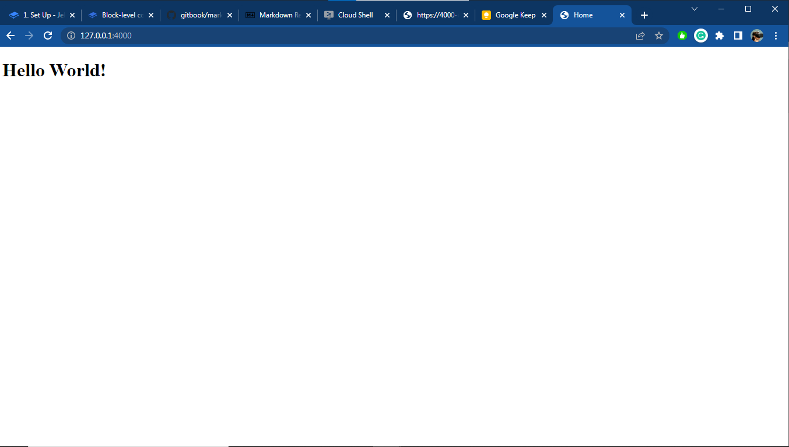

# 1. Set Up

## Introduction

Welcome to Jekyll’s step-by-step tutorial. This tutorial takes you from having some front-end web development experience to building your first Jekyll site from scratch without relying on the default gem-based theme.

## Installation

Jekyll is a Ruby gem. First, install Ruby on your machine. Go to [Installation](https://jekyllrb.com/docs/installation/) and follow the instructions for your operating system.

With Ruby installed, install Jekyll from the terminal:

>Linux
>```shell
>craigsims@cloudshell:~/$ gem install jekyll bundler
>```

>Windows
>```shell
>C:\Users\craigsims\dev> gem install jekyll bundler
>```

> **Optional:**
>
> Create a folder called `jekyll` and `cd` into it
>
> ```shell
> craigsims@cloudshell:~/$ mkdir jekyll
> craigsims@cloudshell:~/$ cd jekyll
> craigsims@cloudshell:~/jekyll$ 
> ```

Create a new `Gemfile` to list your project's dependencies:

```shell
craigsims@cloudshell:~/jekyll$ bundle init
```

```shell
C:\Users\craigsims\dev\jekyll> bundle init
```

Edit the `Gemfile` in a text editor and add jekyll as a dependency.

I'll use `VSCode` to edit. Follow the steps below:

```shell
craigsims@cloudshell:~/jekyll$ code Gemfile
```

```shell
C:\Users\craigsims\dev\jekyll> code Gemfile
```

> `Gemfile`

```ruby
# frozen_string_literal: true

source "https://rubygems.org"

# gem "rails"
gem "jekyll"
```

Run `bundle` to install jekyll for your project.

>Linux
>```shell
>craigsims@cloudshell:~/jekyll$ bundle
>```

>Windows
>```shell
>C:\Users\craigsims\dev\jekyll> bundle
>```

You can now prefix all jekyll commands listed in this tutorial with `bundle exec` to make sure you use the jekyll version defined in your `Gemfile`.

## Create a Site

It's time to create a site! Create a new directory for your site and name it whatever you want. I'll name mine `hello-jekyll`. Then I'll navigate to it.

>Linux
>```shell
>craigsims@cloudshell:~/jekyll$ mkdir hello-jekyll && cd hello-jekyll
>craigsims@cloudshell:~/jekyll/hello-jekyll$ 
>```

>Windows
>```shell
>C:\Users\craigsims\dev\jekyll> mkdir hello-jekyll && cd hello-jekyll
>C:\Users\craigsims\dev\jekyll\hello-jekyll>
>```

Through the rest of this tutorial we'll refer to this directory as **root**.

You can also initialize a Git repository here.

>Linux
>```shell
>craigsims@cloudshell:~/jekyll/hello-jekyll$ git init
>```

>Windows
>```shell
>C:\Users\craigsims\dev\jekyll\hello-jekyll> git init
>```

One of the great things about Jekyll is there's no database. All content and site structure are files that a Git repository can version. Using a repository is optional but is recommended. You can learn more about using Git by reading the [Git Handbook](https://guides.github.com/introduction/git-handbook/).

Let's add your first file. Create `index.html` in **root**.

>Linux
>```shell
>craigsims@cloudshell:~/jekyll/hello-jekyll$ touch index.html && code index.html 
>```

>Windows
>```shell
>C:\Users\craigsims\dev\jekyll\hello-jekyll> type nul > index.html && code index.html
>```

Add the following code to `index.html`:

> `index.html`
>```html
><!DOCTYPE html>
><html>
>  <head>
>    <meta charset="utf-8">
>    <title>Home</title>
>  </head>
>  <body>
>   <h1>Hello World!</h1>
>  </body>
></html>
>```

## Build

Since Jekyll is a static site generator, it has to build the site before we can view it. Run either of the following commands to build your site:

* `jekyll build` - Builds the site and outputs a static site to a directory called `_site`.
* `jekyll serve` - Does `jekyll build` and runs it on a local web server at `http://localhost:4000`, rebuilding the site any time you make a change.

>**INFO**
>---
>When you're developing a site, use `jekyll serve`. To force the browser to refresh with every change, use `jekyll serve --livereload`. If there's a conflict or you'd like Jekyll to serve your development site at a different URL, use the `--host` and `--port` arguments, as described in the [serve command options](https://jekyllrb.com/docs/configuration/options/#serve-command-options)

>**WARNING** ⚠️
>---
>The version of the site that `jekyll serve` builds in `_site` is not suited for deployment. Links and asset URLs in sites created with `jekyll serve` will use `https://localhost:4000` or the value set with command-line configuration, instead of the values set in [your site's configuration file](https://jekyllrb.com/docs/configuration/). To learn about how to build your site when it's ready for deployment, read the [Deployment](https://jekyllrb.com/docs/step-by-step/10-deployment/) section of this tutorial.

Run `jekyll serve` or `bundle exec jekyll serve` in **root** in the terminal:

>Linux
>```shell
>craigsims@cloudshell:~/jekyll/hello-jekyll$ jekyll serve
>```

>Windows
>```shell
>C:\Users\craigsims\dev\jekyll\hello-jekyll> jekyll serve
>```

Go to [http://localhost:4000](http://localhost:4000) in your browser. You should see "Hello World!". As seen below:



>**WARNING** ⚠️
>---
>
>If running `jekyll server` fails with something similar to the following terminal output:
>
>| `internal:C:/Ruby31x64/lib/ruby/3.1.0/rubygems/core_ext/kernel_require.rb:85:in require': cannot load such file -- webrick (LoadError)`. |
>| --- |
>
>Fix it in the terminal with `bundle add webrick` or append `gem "webrick"` to your Gemfile
>```shell
>craigsims@cloudshell:~/jekyll$ bundle add webrick
>```

At this point, you might be thinking, "So what?". The only thing that happened was that Jekyll copied an HTML file from one place to another.

Patience, young grasshopper, there's still much to learn!

Next. you'll learn about Liquid and templating.
